  
  
  <h1>
    Hello, World!
    

      
    

  </h1>

 
  

### :man_technologist: About Me :

- 👀 Interested in **Software Engineering**
- 🎓 Studying **Computer Science** at **University of São Paulo (USP)**
- 💞️ Looking to collaborate on **Free Software** projects
- My Résumé: https://reisaraujo-miguel.github.io/my-resume/

### :fire: My Stats :

  

  
  

<!---
reisaraujo-miguel/reisaraujo-miguel is a ✨ special ✨ repository because its `README.md` (this file) appears on your GitHub profile.
You can click the Preview link to take a look at your changes.
--->
